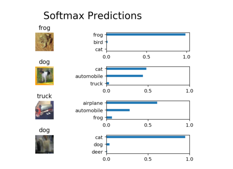

Image Classification
=============================================================================================================

In this project, you'll classify images from the [CIFAR-10
dataset](https://www.cs.toronto.edu/~kriz/cifar.html). The dataset consists of
airplanes, dogs, cats, and other objects. You'll preprocess the images, then
train a convolutional neural network on all the samples. The images need to be
normalized and the labels need to be one-hot encoded. You'll get to apply what
you learned and build a convolutional, max pooling, dropout, and fully connected
layers. At the end, you'll get to see your neural network's predictions on the
sample images.

Use
[dlnd_image_classification.ipynb](https://github.com/abhiyantaabhishek/UdacityImageClassification/blob/master/dlnd_image_classification.ipynb)
as main file.

Below is the output of the model:

